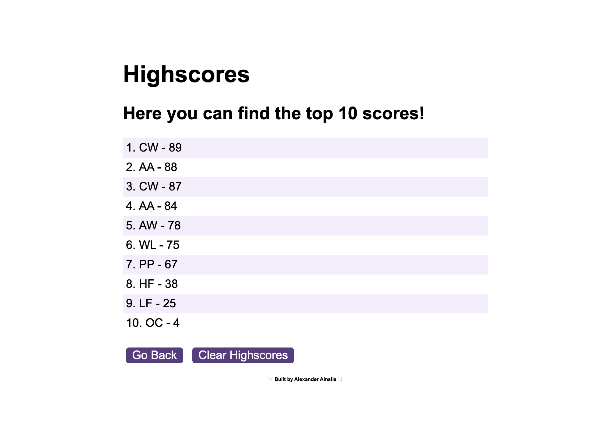

# Coding-Quiz

## Description

This application provides an example of Javascript usage to create a coding quiz.

This coding quiz follows these criteria:
* Starts at the click of a button.
* Has a timer that counts downs when started.
* Provides a question with multiple buttons as answers.
* If answer is correct, a alert comes up along with a sound to inform player.
* If answer is incorrect, an alert comes up along with a sound to inform player.
* An incorrect answer also removes 10 seconds from timer.
* When timer hits 0 or 10 question are answered, the quiz finishes, allowing player to enter initials to add to a score leaderboard.
* Score is the remaining time, therefore the higher the better.
* Allows access to leaderboard, with 10 scores saved on Local Storage.

## Usage

This application provides a coding quiz based on HTML, CSS and JavaScript questions. The players has to answer 10 questions in 100 seconds. These 10 questions are randomly chosen from a pool of 20 questions. This pool can be changed and increased if needed. 

Below are some screenshots of the application:

#### Starting Page
.png)

#### Question Page
.png)

#### Score and Submit Page
.png)

#### Leaderboard Page

## Credits

N/A

## Deployed Application
Link to deployed webpage: https://alexains.github.io/Password-Generator/